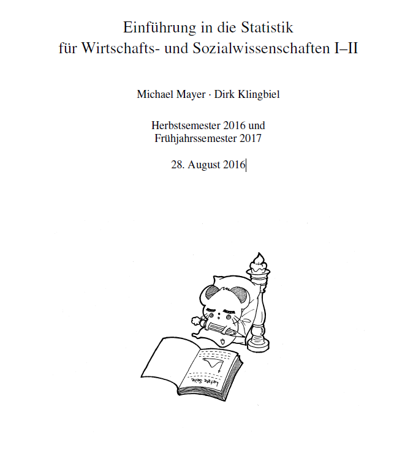

# Lecture notes: Einführung in die Statistik für Wirtschafts- und Sozialwissenschaften I–II

Lecture notes of the introductory lecture in statistics for students in economic and social sciences held between 2010 and 2017 by Dirk Klingbiel and Michael Mayer. 

Methods are accompanied with R code and output.

## Copyright

These lecture notes are being distributed under the [creative commons license](https://creativecommons.org/licenses/by/2.0/).

## How to cite?

Michael Mayer and Dirk Klingbiel (2016). "Einführung in die Statistik für Wirtschafts- und Sozialwissenschaften I–II". Lecture notes. Web: https://github.com/mayer79/Statistikskript_WiSo

## Title page

